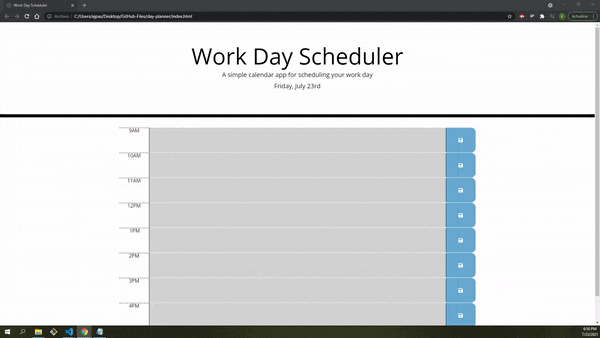

# Day Planner

## Description

Day Planner App is a simple calendar application that allows user to save events for each hour of the day and store the information locally on their browser. This app's formatting is updated dynamically based on the current date.

### Links

* Github Repository: https://github.com/ejpascualj/day-planner
* Deployed Application: https://ejpascualj.github.io/day-planner/

## Application Demo

## Development & Features

The technologies used for this development include: 
* jQuery
* JavaScript
* Moment.js
* Bootstrap
The features of the app include:
* live update of date and time using Moment.js
* text boxes for users to input their events
* conditional formatting of each time block based on the current time
* local storage of information for access even after the window has been closed

## License

This project is licensed under MIT license.